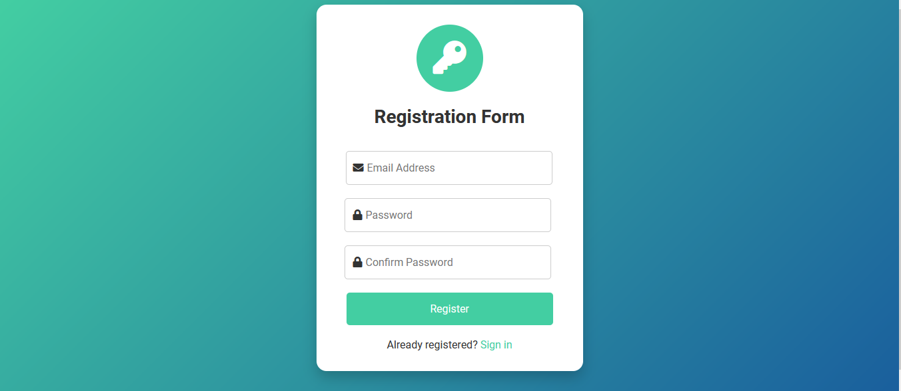
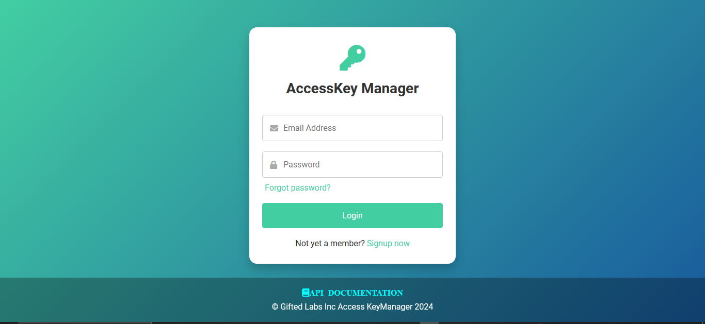
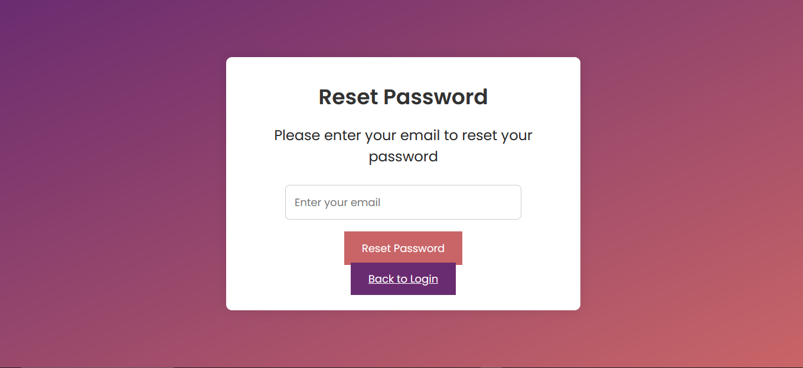
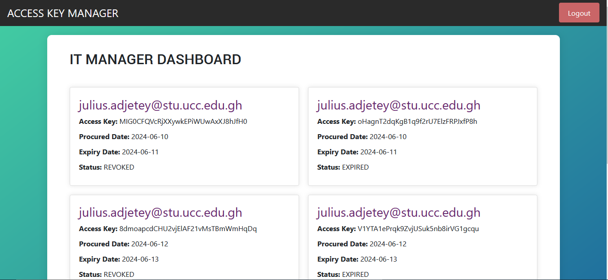
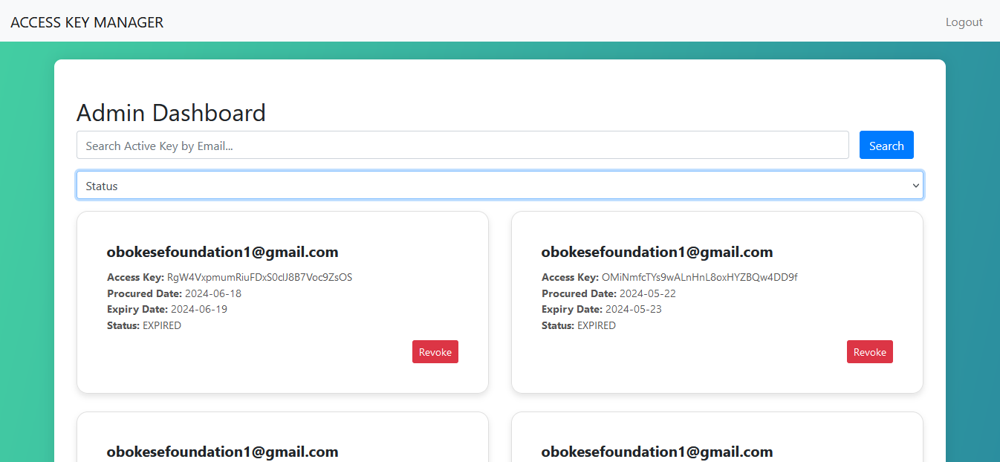
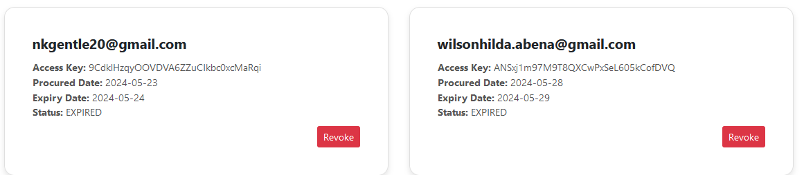
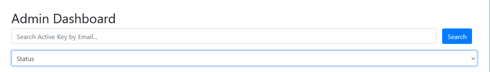
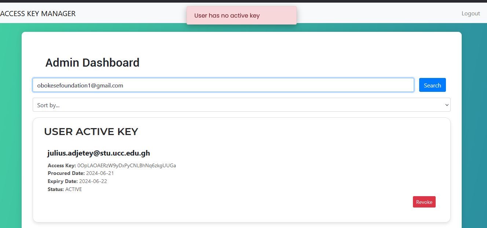
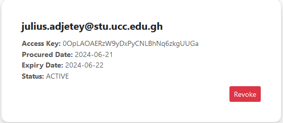
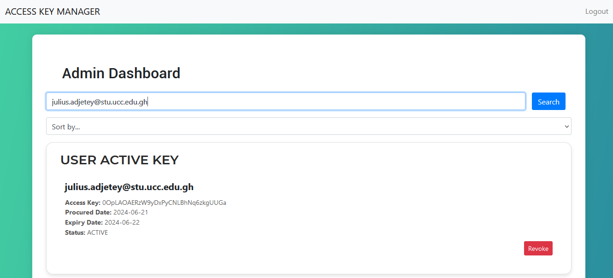

# Access Key Manager

## Project Overview

The Access Key Manager is a Java Spring Boot application built with Java 21 to help Micro-Focus Inc., a software company, monetize their school management platform. The application allows schools to purchase and manage access keys to activate their school account on the platform.

The Application is in two folds, the API and the Web application, the following are the endpoints you can use to access either of them.
```shell
    #To Access the API use: 
    /api/auth/login
    
    #To access the Web use:
    /public/login
```

## Table of Contents
1. [Getting Started](#getting-started)
  1. [Prerequisites](#prerequisites)
  2. [Installation](#installation)
  3. [Running the Application](#running-the-application)
  4. [Endpoints](#endpoints)
2. [Customer Requirements](#customer-requirements)
   1. [School IT Personnel](#school-it-personnel)
     1. [Sign up and Login](#sign-up-and-login)
     2. [Access Key Management](#access-key-management)
     3. [Access Key Details](#access-key-details)
     4. [Single Active Key](#single-active-key)
  2. [Micro-Focus Admin](#micro-focus-admin)
    1. [Admin Login](#admin-login)
    2. [Key Revocation](#key-revocation)
    3. [Access Key Management](#access-key-management-1)
    4. [Key Status Lookup](#key-status-lookup)
3. [Technical Requirements](#technical-requirements)
4. [Deployment and Documentation](#deployment-and-documentation)
5. [Contribution Guidelines](#contribution-guidelines)
6. [Contributors](#contributors)
7. [Admin Login Details](#admin-login-details)
8. [License](#license)

## Getting Started

### Prerequisites

Before you begin, ensure you have met the following requirements:
- Java 21 installed
- Maven installed
- PostgreSQL or MySQL database set up

### Installation

1. Clone the repository:
    ```sh
    git clone https://github.com/yourusername/access-key-manager.git
    ```

2. Navigate to the project directory:
    ```sh
    cd access-key-manager
    ```

3. Install dependencies and build the project:
    ```sh
    mvn clean install
    ```

4. Configure your database settings in `src/main/resources/application.properties`:
    ```properties
    spring.datasource.url=jdbc:postgresql://localhost:5432/yourdatabase
    spring.datasource.username=yourusername
    spring.datasource.password=yourpassword
    ```

### Running the Application

Start the Spring Boot application:
```sh
mvn spring-boot:run
```

### API Endpoints

Here are the main endpoints available in the application:

**User Authentication**
- Sign Up: `POST /api/auth/register`
- Login: `POST /api/auth/login`
- Reset Password Initiate: `POST /api/auth/reset`
- Update Password: `POST /api/auth/update`
- Reset Password Verification `POST /api/auth/resetPassword`

**School IT Personnel**
- View Access Keys: `GET /api/users/all`
- Generate New Key: `POST /api/users/generate`

**Micro-Focus Admin**
- View All Keys: `GET /api/admin/dashboard`
- Get All Keys Of A School: `GET /api/admin/userkeys`
- Revoke Key: `POST /api/admin/revoke`
- Key Status Lookup: `GET /api/admin/keys/status?email={schoolEmail}`


### WEB Endpoints

Here are the main endpoints available in the application:

**User Authentication**
- Sign Up: `POST /public/register`

- Login: `POST /public/login` 
- Reset Password Initiate: `POST /public/reset` 
- Update Password: `POST /public/update`
- Reset Password Verification `POST /public/resetPassword`

**School IT Personnel**
- View Access Keys: `GET /web/users` 
- Generate New Key: `POST /web/users/generate` 

**Micro-Focus Admin**
- View All Keys: `GET /web/admin/dashboard` 
- Get All Keys Of A School: `GET /web/admin/search`
- Revoke Key: `POST /api/admin/revoke` 
- Key Status Lookup: `GET /api/admin/keys/status?email={schoolEmail}`  


## Customer Requirements

### School IT Personnel

#### Sign up and Login

- School IT personnel should be able to sign up and log in with an email and password.
- There should be a reset password feature to recover lost passwords.

**Sign Up Page:** https://accesskeymanager-5ng4.onrender.com/public/register 
**Login Page:** https://accesskeymanager-5ng4.onrender.com  
**Reset Password Page:** https://accesskeymanager-5ng4.onrender.com/public/reset

#### Access Key Management

- School IT personnel should be able to see a list of all access keys granted, including active, expired, or revoked keys.

**Access Key List Page:** 

#### Access Key Details

- For each access key, the personnel should be able to see the status, date of procurement, and expiry date.

**Access Key Details Page:** 

#### Single Active Key

- A user should not be able to get a new key if there is an active key already assigned to them. Only one key can be active at a time.

**New Access Key Page:** 

### Micro-Focus Admin

#### Admin Login

- Micro-Focus admin should be able to log in with an email and password.

**Admin Login Page:** [Link to Admin Login Page]

#### Key Revocation

- Micro-Focus admin should be able to manually revoke a key.
```shell
    # For the api instance of the application,
    # use the following endpoint to access the revoke function
    # Throws 404 error when the email provided has no active key
    
    /api/admin/revoke?email="email of the user you want to revoke"
    
```

**Key Revocation Page:** The admin can also manually revoke an active key of a user. 

#### Access Key Management

- Micro-Focus admin should be able to see all keys generated on the platform and their status, date of procurement, and expiry date.

**Access Key Management Page: The admin's dashboard to view all the generated keys 

#### Key Status Lookup

- Micro-Focus admin can be able to access an endpoint, such that if a school email is provided, the endpoint should return a status code of 200 and details of the active key if any is found, else it should return 404. This is to enable them to integrate their school software with the key manager.

**Key Status Lookup Endpoint:** 

```shell
#The admin can use the following endpoint to access the active key 
#by providing the school's email

api/admin/activeKey?email=("Email of the school")
```

- The Micro-Focus admin can search through the cards of keys to find the active key by entering the schools email.



## Technical Requirements

The Access Key Manager should be built as a Java Spring Boot application using Java 21. The application should have the following features:

1. **User Authentication:** The application implements a secure user authentication system, including sign-up, login, and password reset functionality, using Spring Security.
2. **Access Key Management:** The application provides functionality to create, view, and manage access keys for schools using Spring Data JPA and a relational database.
3. **Access Key Status:** It maintains the status of each access key (active, expired, revoked) and display the relevant information to both school IT personnel and Micro-Focus admin.
4. **Single Active Key Enforcement:** The application ensures that a school can have only one active access key at a time using transaction management and optimistic locking.
5. **Admin Functionality:** The application implements administrative features, including the ability to revoke access keys and view all generated keys, using role-based access control.
6. **Key Status Lookup Endpoint:** It has a RESTful API endpoint that allows Micro-Focus to check the status of a school's access key using Spring MVC.
7. **Database Integration:** It Uses a relational database, such as PostgreSQL to store user and access key information, and leverages on Spring Data JPA for database interactions.
8. **Security:** It implements appropriate security measures, such as password hashing, input validation, and rate limiting, using Spring Security and other security libraries.
9. **Responsive Design:** It ensures that the web application is responsive and accessible across different devices and screen sizes using a modern front-end such as thymeleaf,  integrated with the Spring Boot backend.
10. **Error Handling and Logging:** Provide robust error handling and logging mechanisms using Spring Boot's built-in error handling and logging capabilities to facilitate troubleshooting and monitoring.

## Deployment and Documentation

### Deployment

The application is deployed to render.com and it leverages on a database hosted on render and it uses Dockerfile to build the image.
### Documentation

```shell
    #Link to the documentation page
    https://accesskeymanager-5ng4.onrender.com/public/docs
```
## Contribution Guidelines

If you would like to contribute to the development of the Access Key Manager, please follow these guidelines:

1. Fork the repository and create a new branch for your feature or bug fix.
2. Make your changes and ensure that the application still meets the requirements outlined above.
3. Test your changes thoroughly, including unit tests and integration tests using frameworks like JUnit and Mockito.
4. Submit a pull request, describing the changes you have made and the issue it addresses.

We welcome all contributions that help improve the functionality and reliability of the Access Key Manager.

## Contributors

- Julius Adjetey Sowah - [https://github.com/Gifted-Labs](https://github.com/Gifted-Labs)


## Admin Login Details

For testing purposes, you can use the following admin login details:

- Email: juliusadjeteysowah@gmail.com
- Password: 123456

**Note:** Change these credentials in the production environment for security purposes.

## License

This project is licensed under the MIT License.